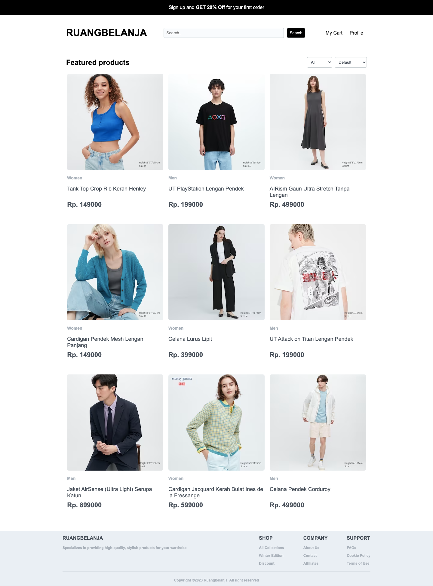

# Ecommerce - Ruangbelanja part 2

## Assignment

### NOTES

-   Pada skeleton kode yang terdapat file `main.test.js` tidak boleh diubah sama sekali.
-   Dilarang mengganti nama _function_ yang diberikan.
-   Wajib menjalankan `npm install` atau `pnpm install` sebelum mengerjakan project.
-   Wajib mengerjakan assignment sebelumnya!!!
-   Kerjakan pada file `App.js`, `NavBar.jsx`, `Card.jsx` dan `Footer.jsx`

### Description

Pada _assignment_ ke 2 ini kalian diminta untuk melanjutkan pembuatan sebuah halaman _web_ _Ecommerce_ dengan nama "RUANGBELANJA" (**Gunakanlah kode yang sudah dibuat di _assignment_ sebelumnya**). Yang perlu kalian lakukan adalah menambahkan beberapa fitur pada halaman _web_ _ecommerce_ kalian, antara lain:

-   Mengaktifkan fitur _search_ pada _search bar_ yang sudah di buat pada _assignment_ sebelumnya.
-   Membuat fitur _sort_ data berdasarkan data `id` dan harga baik dari terendah ke tertinggi serta tertinggi ke terendah.
-   Membuat fitur _filter_ data berdasarkan kategori yang dimiliki.

Kalian diberikan juga sebuah file `json-server` dengan nama `products-db.json` dalam folder `/server` sebagai _server_ kalian.

> Server dapat di jalankan menggunakan command `npm run start:server` dan akan berjalan pada `http://localhost:3001`.

Berikut penjelasan dari dari setiap _component_.

#### `App.js`

Pada file ini kalian diminta untuk melakukan beberapa hal, antara lain:

1. Melakukan _fetch_ data dari `json-server`, dimana data yang terdapat pada `json-server` merupakan data _products_ yang akan kalian jual pada halaman _web_ _ecommerce_ kalian. Data akan langsung ditampilkan setiap kali halaman di _render_.

    Jika data belum ada maka akan menampilkan pesan "**Loading ...**" dalam elemen `p`, namun jika data yang diterima sudah ada maka akan dilempar ke dalam _custom component_ `Card` yang sebelumnya perlu kalian _import_.

2. Membuat fitur _sort_ data berdasarkan data `id` dan harga baik dari terendah ke tertinggi serta tertinggi ke terendah dengan ketentuan berikut:

    - Elemen _sort_ dibuat menggunakan elemen `select`
    - Memiliki _attribute_ `data-testid` dengan _value_ `sortBy`
    - Terdapat **3 _options_** berupa `Default`, `Low to high`, dan `High to low`
    - _Option_ `Default` memiliki _value_ `default` dan akan melakukan _sort_ data berdasarkan `id` dari sebuah _product_ dari terendah hingga tertinggi.
    - _Option_ `Low to high` memiliki _value_ `asc` dan akan melakukan _sort_ data berdasarkan `price` dari sebuah _product_ dari terendah hingga tertinggi.
    - _Option_ `High to low` memiliki _value_ `desc` dan akan melakukan _sort_ data berdasarkan `price` dari sebuah _product_ dari tertinggi hingga terendah.

3. Membuat fitur _filter_ data berdasarkan kategori yang dimiliki dengan ketentuan berikut:

    - Elemen _filter_ dibuat menggunakan elemen `select`
    - Memiliki _attribute_ `data-testid` dengan _value_ `filterBy`
    - Terdapat **3 _options_** berupa `All`, `Men`, dan `Women`
    - _Option_ `All` memiliki _value_ `All` dan akan menampilkan seluruh data.
    - _Option_ `Men` memiliki _value_ `Men` dan akan melakukan _filter_ yang akan menampilkan seluruh data dari kategori `Men`.
    - _Option_ `Women` memiliki _value_ `Women` dan akan melakukan _filter_ yang akan menampilkan seluruh data dari kategori `Women`.

4. Buatlah _state_ menggunakan React _hook_ `useState` sesuai kebutuhan.

#### `NavBar.jsx`

Pada _component_ ini kalian diminta untuk mengaktifkan fitur _search_ pada _search bar_ yang sudah di buat pada _assignment_ sebelumnya dengan ketentuan berikut:

-   Elemen `input` dibungkus didalam sebuah tag `form`
-   Elemen `form` memiliki _attribute_ `data-testid` dengan _value_ `searchForm`
-   Elemen `input` memiliki _attribute_ `data-testid` dengan _value_ `searchInput`
-   Fitur _search_ akan mencari data berdasarkan `name` dari sebuah _product_.
-   Terdapat elemen `input` dengan type `submit` dan value `search` yang berfungsi sebagai `button` search. Elemen tini memiliki `data-testid` dengan _value_ `searchButton`.
-   _Keyword_ yang di-_input_ bersifat _**incase sensitive**_, yang artinya **huruf besar dan huruf kecil diartikan sama**.
-   _Keyword_ yang di-_input_ dapat berupa nama _product_ secara lengkap atau hanya sekedar potongannya saja.
    > Misal: nama dari _product_ berupa "UT PlayStation Lengan Pendek", maka kita dapat memasukan seluruh nama tersebut atau hanya sekedar "Lengan" untuk mencari _product_ tersebut.
-   _Keyword_ yang di-_input_ akan mencari seluruh data yang memiliki nama yang mengandung keyword yang di-_input_.
    > Misal: terdapat _product_ dengan nama "UT Attack on Titan Lengan Pendek", "Cardigan Pendek Mesh Lengan Panjang" dan "Celana Lurus Lipit". Lalu kita memasukan _keyword_ berupa "lengan" maka secara otomatis akan menampilkan _product_ "UT Attack on Titan Lengan Pendek" dan "Cardigan Pendek Mesh Lengan Panjang".

#### `Card.jsx`

_Component_ ini di gunakan untuk me-_render_ sebuah _Product Card_. Pada _component_ ini terdapat sebuah function `Card` yang menerima props dengan format sebagai berikut:

| Name       | Data Type |
| ---------- | --------- |
| _image_    | string    |
| _category_ | string    |
| _name_     | string    |
| _price_    | number    |

Pada bagian ini yang perlu kalian lakukan adalah membuat sebuah _Product Card_ dan menampilkan data `props` yang dilempar dari file `App.js` dengan **_minimum requirement_** sebagai berikut:

1. Memiliki _attribute_ `data-testid` dengan _value_ `card`
2. Memiliki _attribute_ `class` dengan _value_ `product-card`.
3. Memiliki _image_ dengan `src` dari props `image` dan `alt` dari props `name` (**tanpa ada prefix maupun suffix**).
4. Memiliki _product category_ dari props `category` dengan menggunakan tag `p`.
4. Memiliki _product name_ dari props `name` dengan menggunakan tag `p`.
5. Memiliki _product price_ dari props `price` dengan menggunakan tag `p`.

#### `Footer.jsx`

_Component_ ini di gunakan untuk me-_render_ sebuah _Footer_. Pada bagian ini yang perlu kalian lakukan adalah membuat sebuah footer dengan **_minimum requirement_** sebagai berikut:

1. Memiliki _attribute_ `data-testid` dengan _value_ `footer`
2. Memiliki _attribute_ `class` dengan _value_ `footer`.
3. memiliki teks berupa `Copyright ©2023 Ruangbelanja. All right reserved` dengan menggunakan tag `p`.

> notes: Kalian di bebaskan untuk menambah _element_ HTML lainnya untuk mempercantik footer kalian.

### Preview

Berikut contoh dari halaman _Ecommerce_ yang perlu di buat (Tambahan _element_ lainnya bersifat **_optional_**).

klik gambar untuk melihat video, atau klik [disini](https://youtu.be/qkpCXYnxHnQ)

> Silahkan lakukan styling dengan kreatifitas yang kalian miliki.